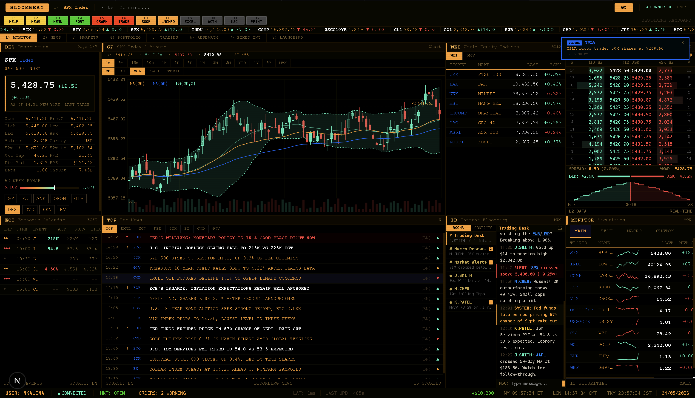

# Bloomberg Terminal UI



A full-featured Bloomberg Terminal clone built with Next.js, React, and TypeScript. Features real-time data simulation, canvas-rendered charts, and the signature amber-on-black aesthetic.

## Features

- **8 Tabs**: Monitor, News, Markets, Portfolio, Trading, Research, Fixed Income, Launchpad
- **30+ Components**: Security panel, candlestick charts, order book depth, heatmap, watchlist, options chain, yield curve, earnings calendar, analyst ratings, equity screener, trade blotter, and more
- **Canvas Rendering**: High-performance charts with devicePixelRatio scaling and ResizeObserver
- **Live Simulation**: Real-time price ticks, order fills, news headlines, and market data updates
- **EMSX Trading**: Execution management with order entry, broker/algo routing, and fill tracking
- **Bloomberg Styling**: Monospace fonts, amber (#FFA028) on black, data-dense grid layouts

## Tech Stack

- Next.js 16 (App Router)
- React 19
- TypeScript
- Tailwind CSS 4
- HTML5 Canvas

## Getting Started

```bash
npm install
npm run dev
```

Open [http://localhost:3000](http://localhost:3000) to view the terminal.
